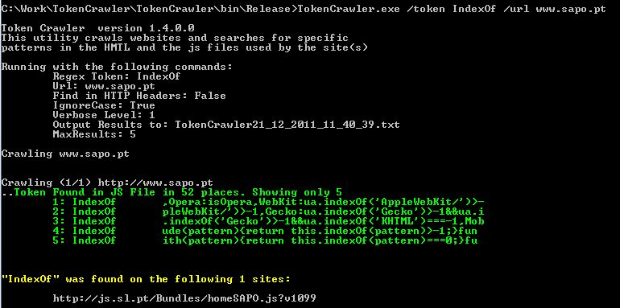

Token Crawler is a command line utility that crawls websites and searches for a specific pattern (Regular Expression) in the HTTP Headers, the HMTL page and in the Javascript files used by the site. It will also show an excert of where the token was found. 

Search engines enable us to search for content, but we cannot search for the source code like html tags, meta information, http headers or in javascript files. This tool enables us to do exactly that on one or multiple sites. 

# Features
- support for Regular Expressions (regex) 
- searches HTTP headers, HTML and Js files 
- included test script and sample files. 
- output results to console and file 
- many other options (check Documentation)

# Run the program.
1st. Download the tool and unzip it on your local drive. Open a command prompt (Start->Run->cmd), change to the directory where you have put the tool, and run the program. For example:
```
c:\TokenCrawler>TokenCrawler.exe /token IndexOf /url www.sapo.pt
```
This will search http://www.sapo.pt for the string "IndexOf" in the HTML and referred JS files.

You can also just run the included test and see it running in multiple scenarios (see TestSites dir for more information):
```
c:\TokenCrawler>test.bat
```
Check the Documentation page for many more execution examples (also using Regular Expresssions (regex)).
2nd. Check the results on console* or on the output file (by default output file is TokenCrawler<date><time>.txt )

Here is a sample execution:


You can also crawl multiple websites. Prepare a new file with one url per line.* For example sites.txt and set the /File option to point to it. Here is a sample urls you can include in your file. Check the TestSites dir on the download package for multiple sample files.
```
	www.youtube.com
	http://www.statcounter.com
```

If you are looking for a way to build the list of sites you can consider List Links that will dump all links in a url, and referred internal urls.
